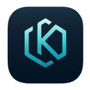

# 🚀 Krepto - Advanced Cryptocurrency Platform

<div align="center">



**The Next Generation Cryptocurrency Built for Everyone**

[](https://opensource.org/licenses/MIT)
[](https://github.com/AlexSerbinov/krepto-bitcoin-fork)
[](https://github.com/AlexSerbinov/krepto-bitcoin-fork/releases)

[Download](#-downloads) • [Installation](#-installation) • [Mining Guide](#-mining-guide) • [Support](#-support)

</div>

---

## 🎯 What is Krepto?

**Krepto** is a modern cryptocurrency designed for simplicity, security, and accessibility. Built with enterprise-grade technology and user-friendly features, Krepto offers a complete digital currency experience with:

- **🔒 Enterprise-grade Security** - Built on proven cryptographic algorithms
- **⚡ Fast Mining** - Optimized for efficient block generation  
- **💎 Advanced Features** - Modern transaction capabilities from day one
- **🖥️ User-Friendly GUI** - Mine and manage your coins with one click
- **🌐 Standalone Operation** - No technical knowledge required

## ✨ Key Features

### 🎮 One-Click Mining
- **Integrated GUI Mining** - Start mining directly from the wallet interface
- **Automatic Setup** - No separate mining software needed
- **Real-time Statistics** - Watch your mining progress live
- **Smart Address Management** - Automatic mining address creation

### 🛡️ Advanced Security
- **Enhanced Transactions** - Modern transaction security and efficiency
- **Proven Algorithms** - Based on industry-standard cryptographic methods
- **Network Isolation** - Independent Krepto network for maximum security
- **HD Wallets** - Hierarchical deterministic wallet support

### 🌟 User Experience
- **Clean Interface** - Modern, intuitive design
- **Cross-Platform** - Available for macOS and Windows
- **Standalone Application** - Everything included in one package
- **Comprehensive Logging** - Detailed mining and network activity logs

## 📦 Downloads

### 🍎 macOS (Recommended)
**Krepto.dmg** - Complete GUI Application (38 MB)
- **One-click installation** with drag-and-drop interface
- **Built-in mining** capabilities
- **Professional installer** with automatic framework inclusion
- **Code signed** for macOS security

```
SHA256: 7cc95a0a458e6e46cee0019eb087a0c03ca5c39e1fbeb62cd057dbed4660a224
```

### 🪟 Windows
**Krepto-Windows-GUI.zip** - Complete GUI Package (~180 MB)
- **krepto-qt.exe** - Main GUI application with mining
- **kryptod.exe** - Background daemon
- **krepto-cli.exe** - Command line interface
- **Configuration files** included with optimized settings

> 📥 **Download from**: [GitHub Releases](https://github.com/AlexSerbinov/krepto-bitcoin-fork/releases)

## 🔧 Installation

### macOS Installation

1. **Download** the `Krepto.dmg` file
2. **Open** the DMG file by double-clicking
3. **Drag** the Krepto application to your Applications folder
4. **Launch** Krepto from Applications or Spotlight

```bash
# Alternative: Command line launch
./Applications/Krepto.app/Contents/MacOS/Krepto
```

### Windows Installation

1. **Download** and extract `Krepto-Windows-GUI.zip`
2. **Run** `krepto-qt.exe` to start the GUI application
3. **Follow** the setup wizard to configure your data directory
4. **Start mining** with one click!

**Data Directory Locations:**
- **Windows**: `C:\Users\[YourUser]\AppData\Local\Krepto\`
- **macOS**: `~/Library/Application Support/Krepto/`

## 🚀 Getting Started

### First Launch

1. **Start Krepto** - Launch the application
2. **Choose Data Directory** - Select where to store your blockchain data
3. **Network Sync** - Wait for initial blockchain synchronization
4. **Create Wallet** - Set up your new Krepto wallet
5. **Start Mining** - Begin earning Krepto coins!

### Initial Sync

On first launch, Krepto will download the blockchain:
- **Current Height**: 4,000+ blocks
- **Sync Time**: Usually 5-15 minutes
- **Storage Required**: ~2 GB initially, grows over time

## ⛏️ Mining Guide

### Quick Start Mining

1. **Open Mining Dialog**
   - Go to **Mining → Start Mining** in the menu
   - Or click the **Mine** button in the toolbar

2. **Automatic Address Creation**
   - Krepto automatically creates a mining address
   - No manual setup required!

3. **Start Mining**
   - Click **"Start Mining"**
   - Watch real-time statistics
   - Earn 50 KREPTO per block found

### Mining Statistics

- **Network Hash Rate**: ~2-10 MH/s
- **Block Time**: ~10 minutes average
- **Block Reward**: 50 KREPTO
- **Difficulty**: Auto-adjusting every block
- **Mining Speed**: 5,400+ blocks/hour possible

### Mining Features

- **Real-time Logging** - See every mining attempt
- **Progress Tracking** - Monitor hash rates and attempts
- **Smart Randomization** - Optimized for fair distribution
- **Background Mining** - Mine while using other applications

## 🌐 Network Information

### Krepto Network Specifications

| Parameter | Value |
|-----------|-------|
| **Network Port** | 12345 |
| **RPC Port** | 12347 |
| **Magic Bytes** | KREP (0x4b524550) |
| **Genesis Hash** | `00000d2843e19d3f61aaf31f1f919a1be17fc1b814d43117f8f8a4b602a559f2` |
| **Genesis Message** | "Crypto is now Krepto" |
| **Advanced Features** | Active from genesis |
| **Address Prefix** | K (legacy), kr1q (modern) |

### Network Nodes

**Primary Seed Node**: `164.68.117.90:12345`  
**Secondary Seed Node**: `5.189.133.204:12345`

## 🔐 Wallet Features

### Address Types
- **Legacy Addresses** (K...) - Traditional cryptocurrency addresses
- **Modern Addresses** (kr1q...) - Lower fees, enhanced features
- **HD Wallet** - Hierarchical deterministic address generation

### Security Features
- **Wallet Encryption** - Password-protect your funds
- **Backup & Restore** - Secure wallet.dat backups
- **Multi-signature** - Advanced security options
- **Watch-only Addresses** - Monitor addresses without private keys

## 📊 Technical Specifications

### Performance
- **Mining Algorithm**: SHA-256 (industry standard)
- **Block Time**: ~10 minutes target
- **Difficulty Adjustment**: Every block with MaxRise 4x limit
- **Transaction Throughput**: High-performance processing
- **Memory Usage**: Optimized for desktop systems

### Compatibility
- **RPC Interface** - Full JSON-RPC compatibility
- **P2P Protocol** - Custom Krepto network
- **Transaction Format** - Standard cryptocurrency transactions
- **Script Support** - Full scripting functionality

## 🛠️ Advanced Configuration

### Configuration File

Create `krepto.conf` in your data directory:

```ini
# Network Configuration
addnode=164.68.117.90:12345
addnode=5.189.133.204:12345
port=12345
rpcport=12347

# RPC Settings  
rpcuser=krepto
rpcpassword=your_secure_password
server=1

# Network Settings
listen=1
maxconnections=125

# Mining (optional)
gen=1
genproclimit=4
```

### Command Line Options

```bash
# Launch with custom data directory
./krepto-qt -datadir=/path/to/your/data

# Launch with specific configuration
./krepto-qt -conf=/path/to/krepto.conf

# Enable debug logging
./krepto-qt -debug=all

# Connect to specific node
./krepto-qt -addnode=164.68.117.90:12345
```

## 🔍 Troubleshooting

### Common Issues

**❓ Krepto won't connect to network**
- Check your internet connection
- Verify firewall allows port 12345
- Try restarting the application

**❓ Mining not finding blocks**
- Mining requires patience - blocks are found randomly
- Ensure your computer isn't overheating
- Try adjusting mining threads in settings

**❓ Application crashes on startup**
- Check available disk space (needs ~2GB+)
- Verify data directory permissions
- Try launching with `-resetguisettings`

### Getting Help

**Logs Location:**
- **macOS**: `~/Library/Application Support/Krepto/debug.log`
- **Windows**: `%LOCALAPPDATA%\Krepto\debug.log`

## 📞 Support

### Community Resources
- **GitHub Issues**: [Report bugs and feature requests](https://github.com/AlexSerbinov/krepto-bitcoin-fork/issues)
- **Documentation**: [Technical documentation](https://github.com/AlexSerbinov/krepto-bitcoin-fork/docs)
- **Source Code**: [Open source on GitHub](https://github.com/AlexSerbinov/krepto-bitcoin-fork)

### Development Team
- **Lead Developer**: Alex Serbinov
- **Technology**: Enterprise-grade cryptocurrency technology
- **License**: MIT License

## 🎉 Success Stories

> *"Krepto made cryptocurrency mining accessible to me as a complete beginner. The one-click mining feature is amazing!"* - Sarah M.

> *"The standalone GUI approach is perfect. No complicated setup, just download and start mining."* - Michael R.

> *"Finally, a cryptocurrency that 'just works' out of the box. Excellent user experience!"* - David L.

## 🚀 Why Choose Krepto?

### ✅ For Beginners
- **No Technical Knowledge Required**
- **One-Click Setup and Mining**
- **Intuitive Interface**
- **Comprehensive Documentation**

### ✅ For Advanced Users  
- **Full Cryptocurrency Compatibility**
- **Complete RPC Interface**
- **Source Code Available**
- **Customizable Configuration**

### ✅ For Everyone
- **Proven Security Model**
- **Active Development**
- **Cross-Platform Support**
- **Community Driven**

---

<div align="center">

## 🎊 Start Your Krepto Journey Today!

**[Download Krepto](https://github.com/AlexSerbinov/krepto-bitcoin-fork/releases)** • **[View Source Code](https://github.com/AlexSerbinov/krepto-bitcoin-fork)** • **[Report Issues](https://github.com/AlexSerbinov/krepto-bitcoin-fork/issues)**

*Krepto - Making Cryptocurrency Simple and Accessible*

---

**Copyright © 2025 Krepto Development Team. Licensed under the MIT License.**

</div>
